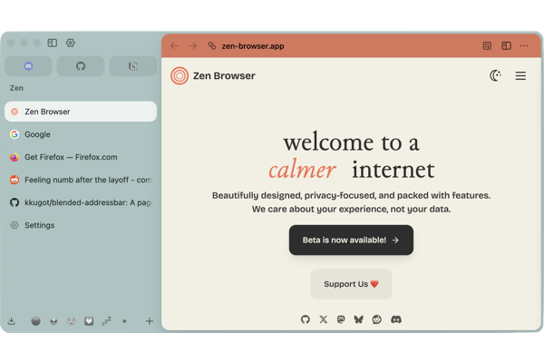
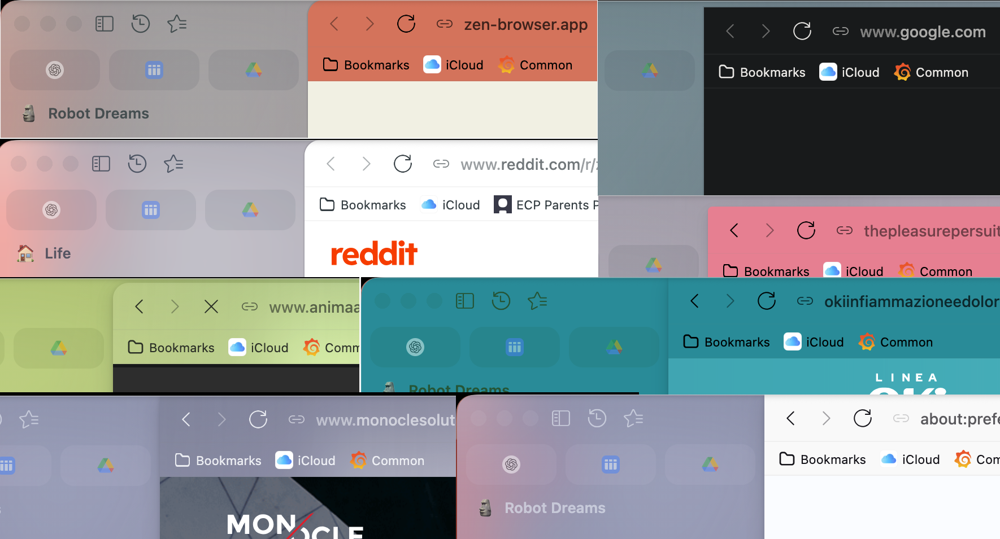

# Blended Addressbar

An addressbar that belongs to the page.

Blended Addressbar is a Zen Browser mod that reshapes the dual-toolbar addressbar into a page-aware browser frame with adaptive colors.

## Features

- Adaptive addressbar background and foreground colors from active-page semantic colors.
- Readability guardrails for adaptive foreground colors.
- Browser window tinting that mixes the active site theme into Zen's existing browser theme instead of replacing it. The tint is optional and configurable by percentage.
- Compact framed browser surface with configurable corner radius, frame gap, padding removal, and selectable shadow strength.
- Split view support that keeps only the outer browser-frame corners rounded while inner split boundaries stay square.
- Compact-mode toolbar icon colors that follow the addressbar foreground.
- Preference-driven loading bar height, opacity, and color source.
- Coalesced active-tab color refreshes using `requestAnimationFrame` plus a timeout fallback, backed by a persistent content sampler and bounded page-color cache.

## Preferences

The mod exposes its settings through `preferences.json`.

- `uc.blended-addressbar.window-tint.enabled`: tint the browser window with active page colors while preserving Zen's existing icon and text colors.
- `uc.blended-addressbar.window-tint.strength`: tint strength as a percentage from `0` to `100`; defaults to `25`.
- Page colors are always remembered in memory while browsing.
- `uc.blended-addressbar.remember-site-colors-longer`: persist remembered site colors across browser restarts; defaults on.
- `uc.blended-addressbar.frame-radius`: outer browser frame corner radius as a CSS length, such as `8px` or `0`.
- `uc.blended-addressbar.frame-gap`: spacing around the browser frame as a CSS length, such as `5px` or `0`.
- `uc.blended-addressbar.frame-padding.disabled`: remove the browser frame padding around page content.
- `uc.blended-addressbar.frame-shadow`: choose the browser frame shadow preset: no shadow, standard, minimal, or medium.
- `uc.loadbar.position`: choose a full-width left-to-right loading bar or a centered loading bar.
- `uc.loadbar.color-source`: choose Zen primary color, page foreground, page background, or a custom color.
- `uc.loadbar.color`: custom loading bar color.
- `uc.loadbar.height`: loading bar height.
- `uc.loadbar.opacity`: loading bar opacity as a percentage.
- `uc.loadbar.roundedcorner`: enable rounded loading bar corners.
- `uc.loadbar.shadow`: enable loading bar shadow.

## Manual Installation

Blended Addressbar is installed through [Sine](https://github.com/CosmoCreeper/Sine). Install and enable Sine first, then:

1. Copy this folder into your Zen profile's `chrome/sine-mods` directory.
2. Reload Sine mods or restart Zen Browser.
3. Enable `Blended Addressbar` from Sine settings.

## Compatibility

This mod targets Zen Browser dual-toolbar layouts. Compact mode is supported, but visual validation is still recommended after Zen updates because browser chrome selectors can change.

## Credits

Some performance-oriented ideas in the current sampler were adapted from [caezium/zen-page-tint](https://github.com/caezium/zen-page-tint), especially the `requestAnimationFrame` scheduling pattern, persistent content sampler, and bounded page-color cache.
