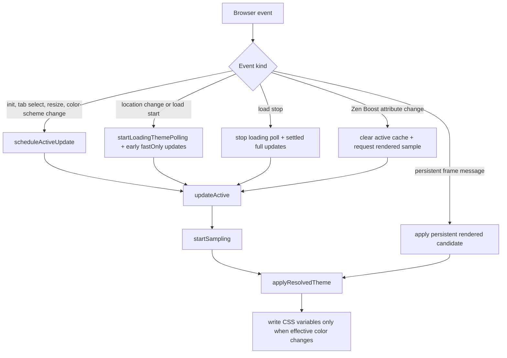
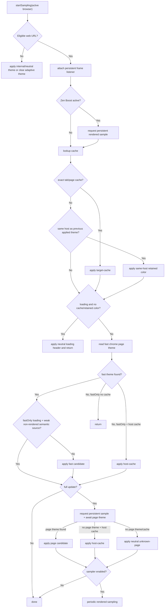
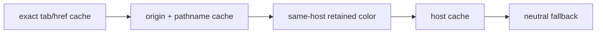

# Adaptive Color Architecture

This document describes the current adaptive color pipeline for Blended Addressbar and a proposed simpler model for future changes.

## Runtime Pieces

- `blended-bar.uc.js` runs in browser chrome. It owns browser lifecycle hooks, cache lookup, source arbitration, CSS variable writes, native Zen tinting, frame preferences, and loading bar preferences.
- `frame.js` runs in page content through a persistent frame listener. It watches page theme mutations, load, and pageshow events, then sends lightweight color samples back to chrome. Scroll does not trigger color updates.
- `style.css` consumes chrome CSS variables such as `--zen-tab-header-background`, `--zen-tab-header-foreground`, `--blended-addressbar-frame-background`, and `--blended-addressbar-window-tint-background`.
- `styles/loadbar.css` consumes loadbar variables and preferences.
- `preferences.json` exposes user settings. Page colors are always remembered in memory; long-lived host cache persistence is controlled by `uc.blended-addressbar.remember-site-colors-longer`.

## Current Event Flow

Most events converge on `scheduleActiveUpdate`, `updateActive`, and `startSampling`.



## Current Start Sampling Flow



## Color Sources

The current code mixes source ordering, source confidence, and source policy in several places. This table describes the effective intent.

| Source | Class | Rendered/trusted? | Confidence | Notes |
| --- | --- | --- | --- | --- |
| `selector-rule` | explicit semantic | yes | 7 | User-defined selector override. Treated as trusted even though it is not a pixel sample. |
| `theme-color` | preferred semantic | no | 7 | Preferred during normal active loads so semantic site color can stay stable. Ignored while Boost requires rendered sources. |
| `top-visible` | visual DOM | yes | 6 | Top visible element from chrome-side DOM read. |
| `pixel-top-edge` / `pixel` | visual pixel | yes | 6 | Persistent content or chrome snapshot of rendered top edge. |
| `dark-reader` | modifier-derived visual | yes | 5 | Uses Dark Reader CSS variables. Treated as rendered because it reflects transformed page colors. |
| `host-cache` | cache fallback | maybe | 4 | Rendered only when its `cachedSource` was rendered. |
| `body` / `html` | weak semantic | no | 3 | Useful fallback, but prone to blink when later visual samples arrive. |
| `document-canvas` | weak semantic | no | 2 | Last document-level fallback before chrome fallback. |
| `sampler` | visual fallback | yes | 1 | Legacy periodic snapshot path. |
| `chrome-contrast-fallback` / `toolbar-fallback` | chrome fallback | no | 1 / 0 | Keeps UI readable when no page signal is available. |

## Cache Layers

- `themeCache`: per-browser `WeakMap` for the current exact tab and href.
- `pageThemeCache`: bounded in-memory cache by origin and pathname. This is the preferred tab-switch fallback after exact tab cache.
- `hostThemeCache`: host-level fallback. It can persist across restarts when `remember-site-colors-longer` is enabled.
- Same-host retention: if the next tab has the same host as the last applied theme, the previous theme can be retained briefly instead of flashing neutral while an unloaded tab restores.

Cache precedence on tab switch is:



## Modifiers And Special Cases

Modifiers change which candidates are trusted and how quickly they can commit.

| Modifier | Current behavior |
| --- | --- |
| Loading | Starts fast polling and early `fastOnly` updates. Neutral loading color is used only when no cache or retained color exists. Weak semantic fast colors are skipped during active loading, except preferred `theme-color`. |
| Tab switch | Coalesces updates, applies exact target cache first, then same-host retained color, then host fallback. Exact or retained cached tab colors are kept without immediately forcing a fresh persistent page sample. Equivalent color keys are no-ops to avoid CSS rewrite blink. |
| Zen Boost | Detected through `#zen-site-data-icon-button[boosting]`. Boost changes clear active page cache, request a persistent rendered sample, and require rendered sources. Non-rendered semantic sources are ignored while Boost is active. |
| Dark Reader | Detected through `--darkreader-neutral-background` and `--darkreader-neutral-text`. Treated as rendered and allowed through Boost gates. |
| Persistent frame | Sends top-edge pixel, theme-color, body/html, or ancestor top-visible samples when the page loads, mutates theme attributes/head metadata, or fires pageshow/load. It does not listen to scroll events. |
| Foreground stability | Background and foreground are applied together. Early candidates can reuse a stable readable foreground to avoid addressbar text blinking before samples catch up. |
| Native window tint | Applies a mixed page color to Zen background variables without replacing Zen's primary/text variables. |

## Why Disturbing Changes Still Happen

Most visible blink comes from one of these transitions:

1. A neutral loading fallback is painted before a useful cache or page signal exists.
2. A broad host cache paints first, then exact page or rendered sample replaces it.
3. A weak semantic source, such as `body` or `html`, paints before a rendered top-edge source.
4. Boost changes the actual rendered page colors after earlier semantic values were cached.
5. Foreground contrast is recomputed after the background has already changed.
6. A fresh tab-switch sample replaces a cached color with a current rendered top-edge color.

Current mitigations exist for each case, but they are spread across scheduling, cache lookup, source confidence, source rendered checks, and CSS no-op checks.

## Implemented Simplification

The first refactor phase is implemented in `blended-bar.uc.js`:

- Color source metadata now lives in `colorSourcePolicies`.
- `isRenderedThemeSource`, `isPreferredSemanticThemeSource`, and `getThemeSourceConfidence` read from the same registry.
- `createResolveContext` centralizes loading, Boost, stable-delay, and pending-candidate inputs before arbitration.
- Fast loading semantic skips now use `shouldSkipFastLoadingTheme` instead of duplicating the condition inline.
- Cached tab switches can now return after painting the cached/retained color, avoiding an immediate persistent-frame sample on switch.

The larger pipeline split below is still proposed.

## Proposed Simpler Model

The code would be easier to reason about if it used three explicit stages:

1. **Collect candidates.** Gather all available color candidates from cache, semantic DOM, rendered pixels, modifiers, and chrome fallback without deciding yet.
2. **Resolve one color state.** Apply a single policy matrix using context such as phase, loading, tab switch, Boost, cache exactness, and source class.
3. **Commit only meaningful changes.** Write CSS variables only when the final `ColorState` actually differs enough to matter.

### Candidate Shape

Use one internal representation for every source:

```js
{
  bg,
  fg,
  href,
  source,
  sourceClass,   // explicit, semantic, visual, cache, fallback
  rendered,      // true when it reflects post-modifier pixels or equivalent
  exactness,     // exact-tab, exact-page, same-host, host, none
  confidence,
  timestamp,
  modifiers     // boost, dark-reader, color-scheme, loading, tab-switch
}
```

### Resolver Policy

The resolver can then be a small policy matrix instead of scattered booleans:

| Context | Preferred behavior |
| --- | --- |
| Tab switch with exact cache | Paint exact tab/page cache immediately and do not force a fresh sample in the same switch turn. |
| Tab switch same host, no exact cache | Retain previous same-host visual color and do not force a fresh sample in the same switch turn. |
| Loading, no cache | Prefer `selector-rule`, `theme-color`, `dark-reader`, or rendered visual source. Avoid neutral unless no useful candidate exists. |
| Loading with weak semantic source | Defer or ignore `body`, `html`, and `document-canvas` until stable. |
| Boost active | Rendered-only mode: accept visual pixel/top-visible/Dark Reader/rendered cache; reject non-rendered semantic and broad host fallbacks. |
| Settled page | Allow semantic preferred sources and rendered sources, but use hysteresis so small or lower-confidence changes do not disturb the UI. |
| Scroll/sticky header | Do not update the adaptive header from scroll alone. Keep the previous color until load, pageshow, metadata/theme mutation, Boost, or navigation changes the candidate set. |

### Simplification Targets

- Replace separate `fastOnly`, `deferNonVisual`, `requireRendered`, `skipToolbarFallback`, and `loading` checks with a `ResolveContext` object and one resolver.
- Replace hard-coded rendered-source arrays and confidence maps with a source registry:

```js
const COLOR_SOURCES = {
  'theme-color': { sourceClass: 'semantic', rendered: false, confidence: 7, preferred: true },
  'pixel-top-edge': { sourceClass: 'visual', rendered: true, confidence: 6 },
  'dark-reader': { sourceClass: 'visual', rendered: true, confidence: 5, modifier: true }
};
```

- Treat Dark Reader, Boost, loading, and tab restore as modifiers on the resolve context, not as separate ad hoc branches.
- Keep the persistent frame as the primary dynamic signal. Use chrome snapshot sampling only as a fallback when the frame script cannot produce a rendered candidate.
- Commit a single `ColorState` containing background, foreground, frame tint, source metadata, and href. This reduces foreground/background mismatch risk.
- Add hysteresis: do not replace a visible color with a lower-confidence or near-identical candidate unless the page, source class, or modifier state changed.

## Recommended Next Step

Refactor in two phases:

1. Add the source registry and `ResolveContext` while keeping existing behavior. This makes tests target policy instead of scattered implementation details.
2. Replace the branch-heavy `startSampling`/`applyResolvedTheme` interaction with `collectCandidates -> resolveColorState -> commitColorState`.

This keeps the current performance wins while making future cases, such as Boost, Dark Reader, semantic theme colors, and tab restore, explicit policy choices instead of one-off guards.
